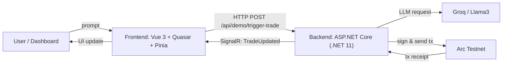

  

# Agora Agent — Bridging Autonomous AI Agents with Real-time On-chain Execution

> Bridging Autonomous AI Agents with Real-time On-chain Execution.

---

## Quick Pitch

Agora Agent is an open-source Proof-of-Concept that demonstrates autonomous, LLM-driven trading agents interacting with a live blockchain testnet and streaming real-time activity to a web dashboard.

---

## Architecture (textual diagram)



Components:
- Frontend: Vue 3 (Composition API), Quasar UI, TypeScript, Pinia store, SignalR client.
- Backend: ASP.NET Core (.NET 11 preview used in this repo), Entity Framework Core (MySQL/Pomelo), Nethereum for Web3 interactions, SignalR hub for real-time events.
- LLM: Groq (or compatible Llama3 family) used for demonstration decisions.
- Blockchain: Arc Testnet for demo transactions and receipts.

---

## Demonstrated Features

- AI-driven trading decisions (demo flow: LLM -> single-word decision -> mapped trade action).
- Real-time on-chain activity streaming to the UI via SignalR.
- Web3 transaction signing and submission using `Nethereum`.
- Autonomous agent supervision and simple strategy worker for demo automation.

---

## Installation & Getting Started

### Prerequisites

- .NET 8+ / .NET 11 preview (used in this repo) and `dotnet` CLI
- Node.js 20+ and package manager (`npm` or `pnpm` recommended)
- Access to an LLM provider (Groq) — API key if you want the LLM-driven demo flow
- A running MySQL-compatible database (the repo uses Pomelo MySQL provider)

### Clone

```bash
git clone https://github.com/AmineC95/AgoraAgent.git
cd AgoraAgent
```

### Backend (API)

```bash
cd AgoraAgentBackend
# Restore and build
dotnet restore
dotnet build
# Run (reads configuration from appsettings.json and environment)
dotnet run
```

### Frontend (Dashboard)

```bash
cd ../AgoraAgentFrontend
# Use npm or pnpm depending on your environment
npm install
npm run dev
# or with pnpm
pnpm install
pnpm dev
```

---

## Configuration (.env and secrets)

The backend and frontend read configuration from `appsettings.json`, environment variables, or a `.env` loader used for development convenience. NEVER commit secrets to the repository. Example `.env` (development only):

```ini
# .env (DO NOT COMMIT)
# .NET uses double-underscore for nested keys when provided as env variables
Arc__RpcUrl=https://rpc.testnet.arc.example
ConnectionStrings__DefaultConnection=Server=HOST;Port=3306;Database=agora;User=USER;Password=PASSWORD;
Groq__Endpoint=https://api.groq.com/openai/v1/chat/completions
Groq__Model=llama3-8b-8192
Groq__ApiKey=sk_xxx
Explorer__TxUrl=https://testnet.arcscan.app/tx/
# Dev-only signer key - DO NOT USE IN PRODUCTION
Arc__PrivateKey=0x...
```

Notes:
- In .NET environment variables, nested config keys like `Arc:RpcUrl` become `Arc__RpcUrl`.
- The backend expects `ConnectionStrings:DefaultConnection` (or the env var `ConnectionStrings__DefaultConnection`).
- Use a secret manager or Vault (Azure KeyVault, AWS Secrets Manager, HashiCorp Vault) for production keys.

---

## Open-Source & Contribution

To contribute:

1. Fork the repository on GitHub.
2. Create a branch: `git checkout -b feature/your-feature`.
3. Run and verify locally.
4. Commit with clear messages and open a Pull Request to the upstream `main` branch.

Suggested workflow:
- Follow .editorconfig and perform `dotnet format` / `npm run lint` before submitting.
- Add unit/integration tests for backend changes (xUnit / integration harness) and run `dotnet test`.

---

## Architecture Decisions

- Why .NET (ASP.NET Core + EF Core)?
  - Mature, performant server-side stack with excellent async programming model.
  - Strong ecosystem for enterprise integrations, database migrations, and observability.
  - `Nethereum` provides a first-class C# SDK for Ethereum-compatible blockchains.

- Why SignalR for realtime?
  - Native support in ASP.NET Core with automatic fallback transports and reconnection logic.
  - Low-latency publish-subscribe model that integrates directly with Hub contexts in server code.
  - Easier client integration (JavaScript) compared to managing raw WebSocket connection scaffolding and reconnection.

- Why Vue 3 / Quasar for frontend?
  - Rapid prototyping and out-of-the-box UI components, good DX, and TypeScript support.

---

## Roadmap (V2 & Beyond)

- Integrate resilient price oracles and on-chain price checks for safe trading decisions.
- Replace native demo transfers with ERC-20 token transfers and enforce bond checks.
- Move BYOK and private key handling to server-side vault-backed signing (no raw keys in browser).
- Backtesting and sandboxed strategy validation before live dispatch.
- Scale SignalR with Redis backplane / Azure SignalR for production.
- Full CI/CD (build, tests, SonarQube) and containerized deploy manifests (Docker + Kubernetes).
- Mainnet readiness: audits, slippage protection, rate limiting, governance controls.

---

## Credits

- **Author:** AmineC95

---

## License

This project is provided as a demonstration PoC. Consider applying a license (e.g., MIT) to suit your organization. Example: `MIT`.

---

## Note

This repository and its implementation were built as a hackathon Proof-of-Concept (PoC). It demonstrates architectural patterns, integration ideas, and a minimal autonomous agent pipeline for educational purposes — it is not production-ready. Review and harden all security, economic, and operational controls before any real-value deployment.

---

If you want, I can also add a CONTRIBUTING.md and update CI examples (GitHub Actions) next.
